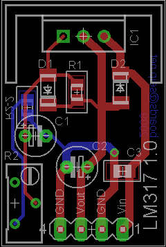
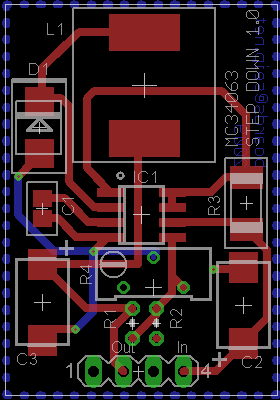
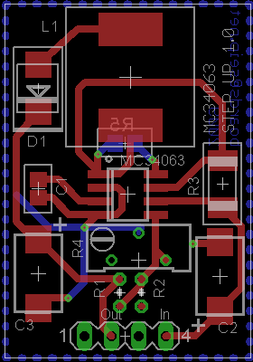
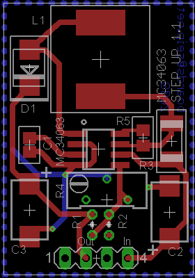
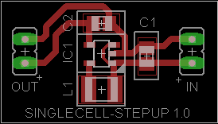
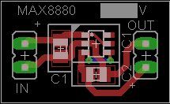

###Regulator-boards

Prototype boards with various switching and linear regulators. The will plug in to regular breadboards.

Made with Eagle

###LM317-01

[Schematic](Images/LM317-01.sch.png)

###MC34063-STEPDDOWN-01

[Schematic](Images/MC34063-STEPDOWN-01.sch.png)

###MC34063-STEPUP-01

[Schematic](Images/MC34063-STEPUP-01.sch.png)

###MC34063-STEPUP-02

[Schematic](Images/MC34063-STEPUP-02.sch.png)

###Versorgung-MAX1724

[Schematic](Images/Versorgung-MAX1724.sch.png)

###Versorgung-MAX8881

[Schematic](Images/Versorgung-MAX8881.sch.png)

###License

[BSD](LICENSE-BSD.txt) for software

[Creative Commons 4.0](LICENSE-CC.txt) for pcb and other artwork

###Copyright

Copyright (c) 2008,2010 Bjoern Seip

